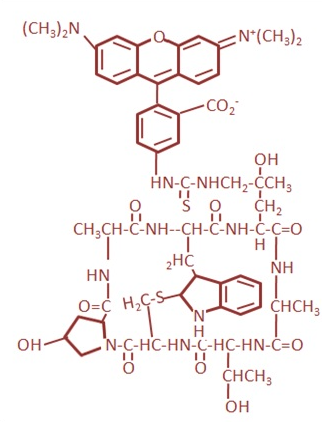

### Theory

The cytoskeleton of a cell provides structure, strength, and motility. It forms a cellular scaffolding upon which internal cellular organization is arranged. It helps maintain cell shape, transports substances within the cell (cellular trafficking), anchors cellular structures, and facilitates motility in eukaryotic cells. The cytoskeleton is composed of three principal types of protein filaments: actin filaments, intermediate filaments, and microtubules, which are interconnected and linked to subcellular organelles and the plasma membrane by a variety of accessory proteins.

The major cytoskeletal protein in most cells is actin. It was first isolated from muscle cells and constitutes approximately 20% of the total cell protein. Actin exists as a globular monomer called G-actin and as a filamentous polymer called F-actin, which is a linear chain of G-actin subunits. G-actin has tight binding sites that mediate head-to-tail interactions with two other G-actin molecules to form F-actin. Because all actin monomers in F-actin are oriented in the same direction, the filaments exhibit polarity. Each actin monomer contains a Mg²⁺ ion complexed with either ATP or ADP, leading to four forms of actin: ADP–G-actin, ATP–G-actin, ADP–F-actin, and ATP–F-actin. Among these, ADP–G-actin and ATP–F-actin are predominant in cells.

The polymerization of G-actin into F-actin is enhanced by the addition of ions such as Mg²⁺, Na⁺, or K⁺. This process is reversible—F-actin depolymerizes into G-actin when the ionic strength of the solution is reduced.

Actin filaments are cross-linked by actin-binding proteins to form bundles or three-dimensional networks. A network of actin filaments and cytoskeletal proteins underlies the plasma membrane and determines cell shape. Actin bundles attach to the plasma membrane and serve as anchors. Actin filaments also support permanent protrusions of the cell surface, like microvilli, as well as transient extensions involved in cell-substratum and cell-cell contact, phagocytosis, and cell locomotion. Muscle contraction results from the sliding interaction of actin and myosin filaments.

Cell locomotion is generated through coordinated movement of different parts of the cell, a process that is complex and difficult to describe in detail. However, major features can be observed using fluorescence microscopy. The machinery driving cell migration is built from the actin cytoskeleton, which is larger than any organelle. In fibroblasts stained for actin filaments and observed under fluorescence microscopy, radially oriented actin filament bundles are seen at the leading edge, while axial bundles, known as stress fibers, are visible beneath the cell body. The rest of the cell contains a dense actin network, although individual filaments are difficult to visualize with light microscopy.

Several fluorescent and biotinylated derivatives of phalloidin and phallacidin are used to label F-actin. These phallotoxins, isolated from the deadly Amanita phalloides mushroom, are bicyclic peptides that differ by only two amino acids. They can be used interchangeably in most applications and bind competitively to the same sites on F-actin. Both phalloidin and phallacidin contain a unique thioether bridge between tryptophan and cysteine residues, forming an inner ring structure. At elevated pH, this thioether bond is cleaved, and the toxin loses its affinity for actin.

Phallotoxin conjugates are very small, with diameters of approximately 12–15 Å and a molecular weight of less than 2000 daltons. Despite this, a variety of actin-binding proteins—including tropomyosin, myosin, DNase I, and troponin—can still bind to actin after treatment with phallotoxins. Importantly, phallotoxin-labeled actin filaments remain functional. Labeled glycerinated muscle fibers still contract, and labeled actin filaments can move along solid-phase myosin substrates. Fluorescent phallotoxins are also used to quantify F-actin in cells. Unlabeled phallotoxins may serve as controls for blocking F-actin staining or for promoting actin polymerization.

Biotinylated and fluorescent phallotoxins stain F-actin at nanomolar concentrations and are water-soluble, making them convenient probes for identifying, labeling, and quantifying F-actin in tissue sections, cell cultures, or cell-free assays. Labeled phallotoxins exhibit equal affinity for both small and large filaments, binding in a stoichiometric ratio of approximately one molecule per actin subunit in muscle and non-muscle cells across various animal and plant species. Unlike antibodies, their binding affinity does not vary significantly across species or sources. Non-specific staining is negligible, providing excellent contrast between stained and unstained regions. Phallotoxins do not bind to monomeric G-actin. Instead, they stabilize F-actin and inhibit depolymerization induced by agents like cytochalasins, potassium iodide, or heat.

Rhodamine phalloidin is the most widely used F-actin stain. It consists of phalloidin conjugated to the orange-fluorescent dye tetramethylrhodamine (TRITC). This red-fluorescent probe binds F-actin with nanomolar affinity and is highly photostable. Fluorescent phallotoxins are typically applied to fixed and permeabilized cells, though they can also be introduced into live cells using cationic liposomes.

&nbsp;

Rhodamine Phalloidin